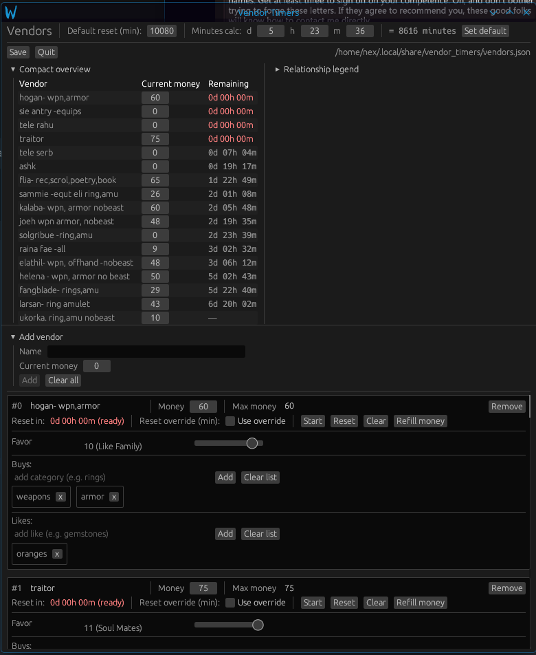

# Vendor Timers

A tiny always-on-top window that tracks NPC/vendor reset timers and money while you play.

- **Linux binary:** `vendortimer`
- **Windows binary:** `vendortimer-win.exe`

## What it does

For each vendor/NPC you can track:

- **Current money** (editable from the compact overview)
- **Max money** (optional; leave blank if unknown)
- **Reset timer** (countdown shown as `Xd HHh MMm`, clamps at `0` when expired)
- Optional **reset override** (otherwise uses the global default)
- **Calc** (to calculate override minutes)
- **Buys** list (custom tags)
- **Likes** list (custom tags)
- **Favor** (1–11 relationship level)

## Files / persistence

Vendor Timers stores all data in a single JSON file:

- Linux: `~/.local/share/vendor_timers/vendors.json`
- Windows: `%LOCALAPPDATA%\vendor_timers\vendors.json` (typically)

This file contains your vendors, timers, money, buys/likes, etc.
